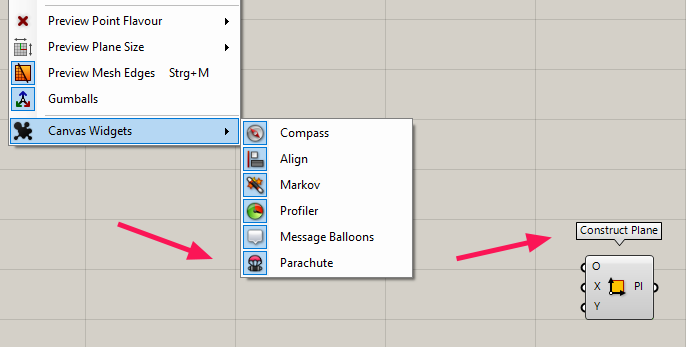

**Parachute** is a [Grasshopper](https://www.grasshopper3d.com/) plugin that 
displays names above components on the canvas. It takes the idea from 
[Bifocals](https://www.food4rhino.com/app/bifocals), thus wraps all 
components in invisible groups with the components' names. But unlike 
Bifocals, which is a component that needs to be dropped onto each file, 
Parachute is a Grasshopper widget that acts globally, on every file opened 
in your canvas.

## How to install

Parachute can be installed with Rhino's Package Manager or downloaded from 
[food4rhino](https://www.food4rhino.com/app/parachute). Follow the 
instruction listed there. You could also build Parachute from source with 
this repo.

## Usage

You can enable or disable Parachute at *Display > Canvas Widgets > Parachute*.

Parachute will not display names above all components, but skips often used 
ones (similar to Bifocals). You can edit the list of components that will be 
ignored in the settings file (*File > Special Folders > Settings Folder* and 
then *parachute.xml*). The components are written with their names in a 
comma separated list. This file is created when you run Parachute for the 
first time. Changes take effect when you reenable Parachute.

When you save a file, the names are saved within the document. If you pass 
this file to someone without Parachute installed, the names will persist and 
there will be no warning about a missing component.

## Getting help

If Parachute is not working as aspected, feel free to open an 
[issue](https://github.com/karamme/parachute/issues).

## License

Parachute is licensed under the [MIT license](LICENSE).